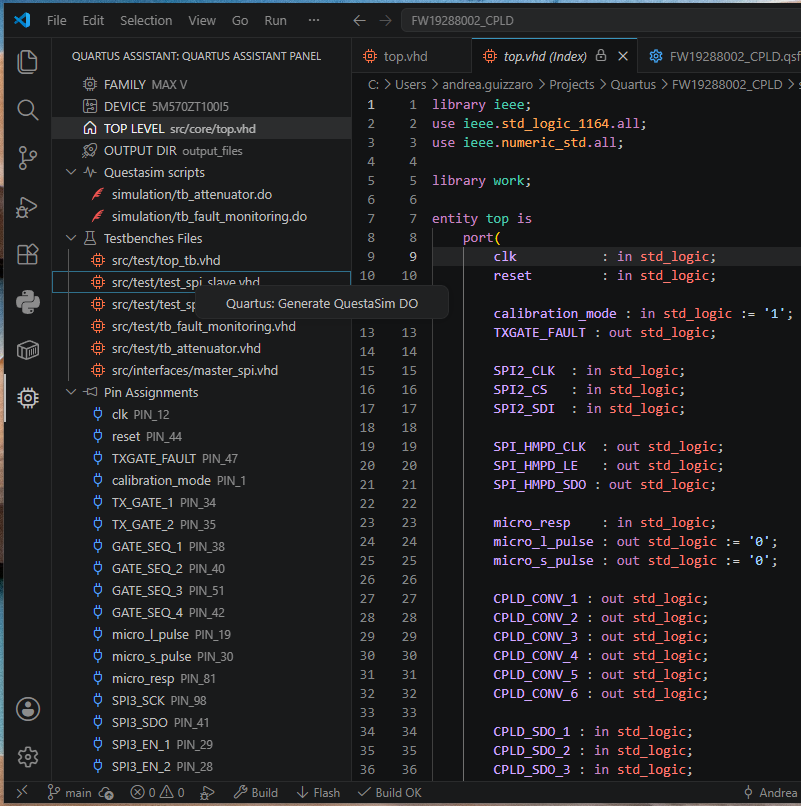
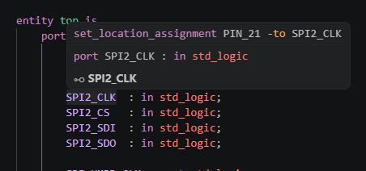
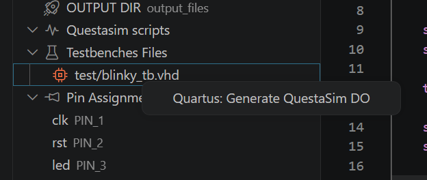
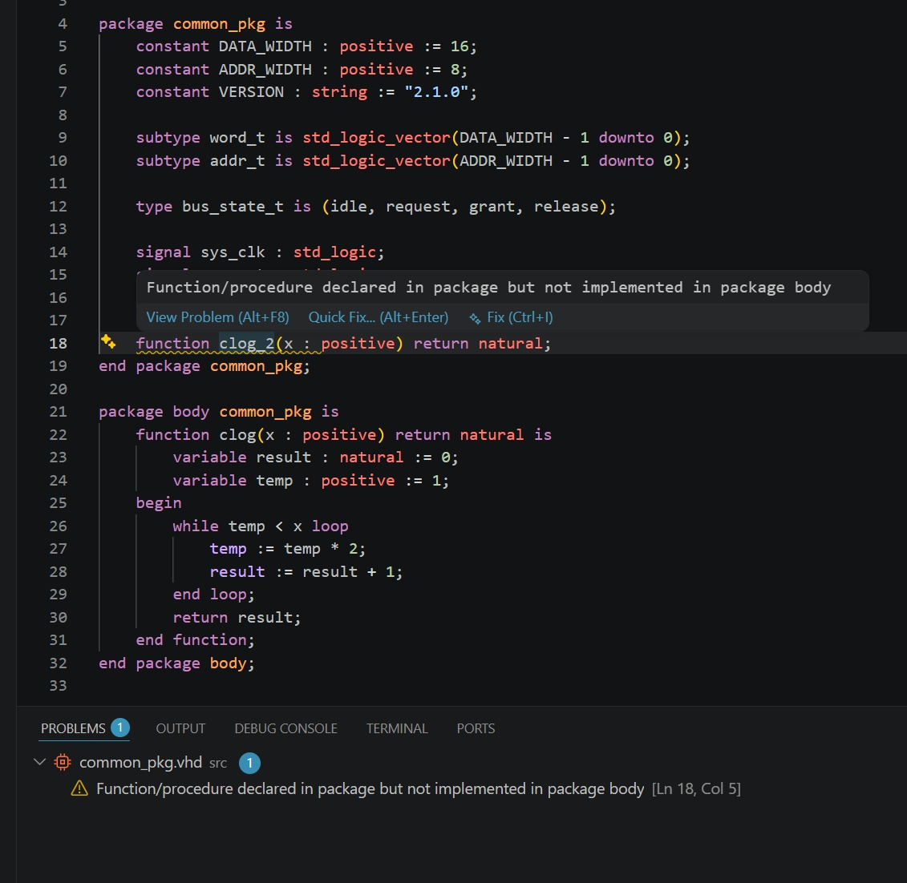
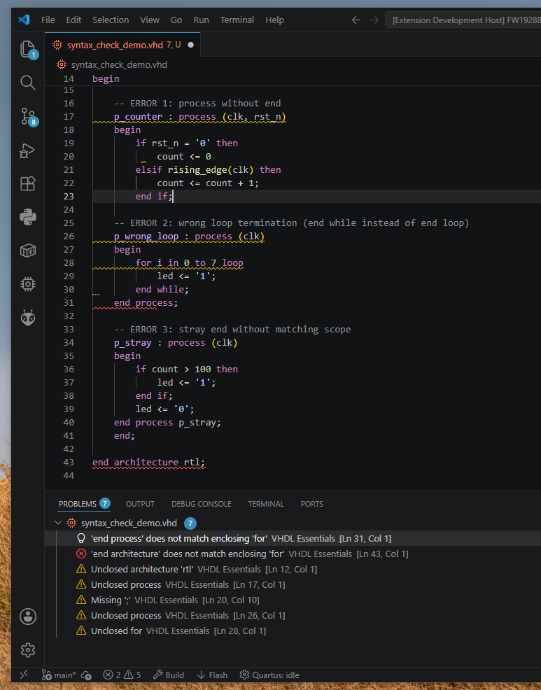

# VHDL Essentials

[](https://marketplace.visualstudio.com/items?itemName=Guizzz.quartus-assistant)
[](https://marketplace.visualstudio.com/items?itemName=Guizzz.quartus-assistant)


Complete Quartus + VHDL workflow integration for Visual Studio Code.



VHDL Essentials brings FPGA development directly into VSCode with:

- ⚡ Quartus build integration
- 🧪 QuestaSim workflow support
- 🔎 VHDL entity/package navigation
- 📌 FPGA pin diagnostics
- 🔗 QSF integration
- 🤖 Automatic `.do` generation
- ✅ VHDL code snippets & templates
- ✅ Real-time VHDL syntax & completeness checking
- 🎨 Semantic highlighting
- 📚 Workspace-wide indexing

---

# ✨ Features

## 🔎 VHDL Navigation

Navigate through your VHDL project with full `Ctrl+Click` support.

Supported navigation:

- entities
- packages
- package symbols
- FPGA pin assignments

Example:

```vhdl
entity work.uart_tx
````

or

```vhdl
use work.pulse_pkg.all;
```

Jump directly to the declaration.

---

## 📌 FPGA Pin Integration

VHDL Essentials understands your `.qsf` constraints and links them directly to VHDL signals.

### 🖱️ Pin Hover Information

Hover a top-level signal to instantly see the assigned FPGA pin.



---

## 🔗 QSF Navigation

`Ctrl+Click` on a VHDL signal to jump directly to the corresponding pin assignment inside the `.qsf` file.

Integrated FPGA-aware navigation between:

* VHDL
* Quartus constraints
* package symbols

---

## 🌲 Quartus Project Explorer

Dedicated FPGA project TreeView integrated inside VSCode.

Features:

* Top-level entity detection
* Pin assignment explorer
* QuestaSim scripts explorer
* Testbench management
* **Left-click** on any file → opens it
* **Right-click** on a testbench → Generate QuestaSim DO
* **Right-click** on a `.do` file → Run QuestaSim simulation



---

## ⚡ Quartus Workflow Integration

Run your FPGA workflow directly from VSCode.

Supported actions:

* Build
* Flash
* Simulation launch
* Questa `.do` generation

Integrated status bar controls:


### 🏗️ Integrated Build and Flash Output

VHDL Essentials provides integrated build execution and live tool output directly inside VSCode.


---

## ⚠️ Diagnostics

VHDL Essentials validates your code on multiple levels:

### 📌 FPGA Pin Diagnostics

* a top-level signal has no assigned FPGA pin → Warning
* constraints are missing from the `.qsf` → Warning
* same `PIN_xx` assigned to multiple signals → Error
* same signal assigned to multiple pins → Warning

### 📝 VHDL Code Linters

* **Duplicate declarations** — duplicate signal, variable, or port names in the same scope
* **Sensitivity list** — signals read inside a process but missing from the sensitivity list
* **Syntax scopes** — unclosed `if`, `process`, `for`/`while` loops, mismatched `end` labels
* **Package body completeness** — function/procedure declared in a package but not implemented in its body

All diagnostics appear in the Problems panel (`Ctrl+Shift+M`) with clear messages.



---

## ✅ Real-Time VHDL Syntax Checking

The extension validates VHDL syntax in real time as you type, highlighting errors directly in the editor.

Checked patterns:

* **Unclosed scopes** — missing `end` for `if`, `process`, `for...loop`, `while...loop`, `case`, `generate`, `block`
* **Wrong loop termination** — `for`/`while` loops must close with `end loop;` (not `end while;`)
* **Missing semicolons** — detected on statement lines (skips component instantiation `label : component`)
* **Unexpected `end`** — stray `end` without a matching open scope
* **Function/procedure body** — declaration without `is` does not open a scope
* **Component instantiation** — `label : entity work.xxx` recognized, no false warnings



Diagnostics appear in the Problems panel (`Ctrl+Shift+M`) with clear messages.

No configuration needed — works out of the box on all `.vhd` and `.vhdl` files.

---

## 🎨 Semantic Highlighting

The extension provides semantic highlighting for:

* entities
* packages
* imported package symbols
* FPGA pin-aware signals

Highlighting only appears when declarations actually exist inside the indexed workspace.


---

## 📚 Automatic Workspace Indexing

Workspace-wide indexing for:

* `.vhd`
* `.vhdl`
* VHDL entities
* packages
* package symbols

The index updates automatically when:

* files are created
* files are deleted
* files are modified

---

## 📝 VHDL Snippets

Type a prefix and press `Tab` to expand into common VHDL constructs.

| Prefix | Expands to |
|---|---|
| `entity` | Entity declaration with port list |
| `arch` | Architecture body |
| `pkg` | Package declaration |
| `pkgb` | Package body |
| `process` | Synchronous process with async reset |
| `proc_nr` | Synchronous process (clock only) |
| `proc_comb` | Combinational process |
| `fsm` | Finite state machine (register + next-state + output) |
| `inst` | Direct entity instantiation with port map |
| `comp` | Component declaration |
| `tb` | Complete testbench template |
| `clock` | Clock generation (`clk <= not clk after 10 ns`) |
| `stim` | Stimulus process |
| `sig` | Signal declaration |
| `sigv` | Vector signal declaration |
| `var` | Variable declaration |
| `const` | Constant declaration |
| `type` | Enumerated type declaration |
| `subtype` | Subtype declaration |
| `case` | Case/when statement |
| `for` | For loop |
| `if` | If/elsif/else statement |
| `func` | Function body |
| `proc` | Procedure body |
| `func_decl` | Function prototype (for packages) |
| `proc_decl` | Procedure prototype (for packages) |
| `forg` | For generate |
| `ifg` | If generate |
| `cnt` | Counter with reset and enable |
| `sr` | Shift register |
| `others` | Others aggregate `(others => '0'/'1')` |
| `wait` | Wait for/on/until |
| `assert` | Assert/report with severity |

No configuration needed — snippets work on all `.vhd` and `.vhdl` files.

---

# 📦 Installation

Install from the [Visual Studio Code Marketplace](https://marketplace.visualstudio.com/items?itemName=Guizzz.quartus-assistant).

**Extension ID**: `Guizzz.quartus-assistant`

Or install from the command line:

```
code --install-extension Guizzz.quartus-assistant
```

---

# ⚙️ Configuration

### `maxv.quartusPath`

Path to your Intel Quartus Prime installation.

| | |
|---|---|
| **Type** | `string` |
| **Default** | `C:\\altera_lite\\25.1std` |
| **Example** | `C:\\intelFPGA\\25.1std` |

Set this in `settings.json`:

```json
{
    "maxv.quartusPath": "C:\\intelFPGA\\25.1std"
}
```

---

# 🛠️ Commands

All commands are accessible via the Command Palette (`Ctrl+Shift+P`).

| Command ID | Title |
|---|---|
| `quartus-assistant.build` | Quartus: Build |
| `quartus-assistant.flash` | Quartus: Flash |
| `quartus-assistant.setQuartusPath` | Quartus: Set Quartus Path |
| `quartus-assistant.generateDo` | Quartus: Generate QuestaSim DO |
| `quartus-assistant.runDo` | Quartus: Run QuestaSim simulation |

---

# 🛠️ Prerequisites

- **Intel Quartus Prime** (Lite/Standard/Pro) — required for build and flash commands
- **QuestaSim** or **ModelSim** — required for simulation and `.do` generation
- **VHDL** source files (`.vhd`, `.vhdl`)
- **Quartus Settings File** (`.qsf`) — required for pin diagnostics and project explorer

---

# ❓ Troubleshooting

| Problem | Solution |
|---|---|
| "Duplicate declaration warnings on entity ports" | Components with matching port names inside the same file are now excluded from parsing |
| "Package body warnings on implemented functions" | Check that the function/procedure name and parameters match the package declaration exactly |
| "Syntax false positive on component instantiation" | Lines matching `label : entity work.xxx` are now recognized and not flagged for missing `;` |
| "Quartus command not found" | Set `maxv.quartusPath` to your Quartus installation folder |
| Pin diagnostics not showing | Ensure a `.qsf` file exists in the workspace root |
| Testbench not appearing | Make sure the testbench entity name matches the filename |
| `.do` file generation fails | Verify that the testbench entity is parsed correctly and all dependencies are in the workspace |
| No hover information | Ensure the workspace index is built (save or reopen files) |
| Build output is empty | Check that `quartus_sh` exists in the configured Quartus path |

---

# 🗺️ Roadmap

Planned features:

* waveform integration
* pin planner integration
* live build transcript streaming

---

# 📄 License

MIT License.
