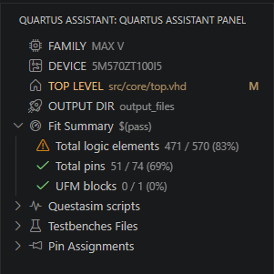
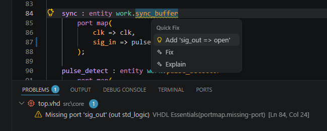

# VHDL Essentials

[](https://marketplace.visualstudio.com/items?itemName=Guizzz.quartus-assistant)
[](https://marketplace.visualstudio.com/items?itemName=Guizzz.quartus-assistant)
[](https://guizzz.github.io/VHDL-Essentials/)

> **The only VS Code extension that combines Quartus build/flash/simulation with VHDL intelligence and QSF-aware diagnostics.**

---

## Quick Start

1. Install the extension
2. Set `maxv.quartusPath` in your VS Code settings:
   ```json
   { "maxv.quartusPath": "C:\\intelFPGA\\25.1std" }
   ```
3. Open a `.qpf` project file and press **Build**

---

## Gallery

<p align="center">
  
  
  <br>
  
  
  <br>
  
  
  <br>
  
  
  <br>
  
  
</p>

---

## Features

### Quartus Integration
- **Build** — compile your project with `Quartus: Build`, errors mapped back to source files
- **Flash** — program your FPGA via JTAG with `Quartus: Flash`
- **New Project** — scaffold a full Quartus project (QPF, QSF, entity, testbench, DO) with `Quartus: New Project`
- **Project Explorer** — tree view showing device, top-level entity, pin assignments, resource utilization, testbenches, and simulation scripts

### VHDL Intelligence
- **Go-to-definition** for entities, packages, and symbols across workspace
- **Hover** showing port signatures, types, and pin assignments
- **Autocomplete** for keywords, entity names, package symbols, and local signals
- **Rename** (`F2`) workspace-wide for entities, signals, variables, constants, ports
- **Find all references** across all VHDL files
- **Signature help** inside `port map(...)` clauses
- **Document symbols** for outline view and breadcrumbs
- **Semantic highlighting** with entity/package/unused signal awareness
- **Formatter** (`Shift+Alt+F`) with configurable indentation

### Linting & Diagnostics
- **Syntax checking** — unclosed scopes, mismatched `end`, missing `begin`, unbalanced parentheses
- **Unused signals** — flags declared but never referenced signals, variables, constants
- **Undeclared identifiers** — flags identifiers that are not declared anywhere
- **Sensitivity list** — detects missing/unnecessary signals in combinational processes
- **Port map validation** — checks port map associations against entity declarations
- **Pin diagnostics** — warns when top-level ports have no pin assignment in QSF
- **Package body** — detects functions/procedures declared but not implemented
- **TODO tracking** — surfaces `TODO`, `FIXME`, `HACK`, `XXX`, `NOTE` in comments
- **QSF lint** — tabs, multi-spaces, unknown commands, duplicate pins/signals

### Simulation
- **Generate DO** — auto-generate QuestaSim `.do` scripts from testbench entities
- **Run DO** — launch QuestaSim with a `.do` file, transcript streamed in real-time
- **Testbench templates** — snippets for self-checking testbenches, clock generation, stimulus

---

## Configuration

| Setting | Type | Default | Description |
|---|---|---|---|
| `maxv.quartusPath` | `string` | `C:\altera_lite\25.1std` | Path to Intel Quartus Prime installation |
| `vhdl.formatter.indentSize` | `number` | `4` | Spaces per indent level |
| `vhdl.formatter.insertSpaces` | `boolean` | `true` | Use spaces instead of tabs |

---

## Prerequisites

- **Intel Quartus Prime** (Lite/Standard/Pro) — for build, flash, and new project
- **QuestaSim** or **ModelSim** — for simulation and `.do` generation
- **VHDL** source files (`.vhd`, `.vhdl`)
- **Quartus Settings File** (`.qsf`) — for pin diagnostics and project explorer

---

## Changelog

### [0.15.4] - 2026-07-07
- **Quartus: New Project** command scaffolds a complete project with guided prompts for device, part, entity, and path

### [0.15.3] - 2026-06-30
- **QSF auto-completion** — file picker when writing `set_global_assignment -name VHDL_FILE` in `.qsf` files

### [0.15.2] - 2026-06-26
- **VHDL Formatter** — `Shift+Alt+F` with configurable indentation, 18 unit tests

[View full changelog](CHANGELOG.md)

---

## Documentation

Full documentation at **[guizzz.github.io/VHDL-Essentials](https://guizzz.github.io/VHDL-Essentials/)**

---

## License

MIT License.
