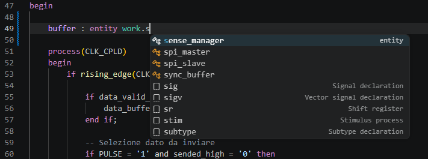

# VHDL Essentials

[](https://marketplace.visualstudio.com/items?itemName=Guizzz.quartus-assistant)
[](https://marketplace.visualstudio.com/items?itemName=Guizzz.quartus-assistant)
[](https://guizzz.github.io/VHDL-Essentials/)

Complete Quartus + VHDL workflow integration for Visual Studio Code.



VHDL Essentials brings FPGA development directly into VSCode with Quartus build/flash integration, QuestaSim workflow support, VHDL entity/package navigation, FPGA pin diagnostics, QSF integration, real-time linting, semantic highlighting, and workspace-wide indexing.

> **Full documentation at [guizzz.github.io/VHDL-Essentials](https://guizzz.github.io/VHDL-Essentials/)**

---

# 📦 Installation

Install from the [Visual Studio Code Marketplace](https://marketplace.visualstudio.com/items?itemName=Guizzz.quartus-assistant).

**Extension ID**: `Guizzz.quartus-assistant`

Or install from the command line:

```
code --install-extension Guizzz.quartus-assistant
```

---

# ⚙️ Configuration

### `maxv.quartusPath`

Path to your Intel Quartus Prime installation.

| | |
|---|---|
| **Type** | `string` |
| **Default** | `C:\\altera_lite\\25.1std` |
| **Example** | `C:\\intelFPGA\\25.1std` |

Set this in `settings.json`:

```json
{
    "maxv.quartusPath": "C:\\intelFPGA\\25.1std"
}
```

---

# 🛠️ Commands

All commands are accessible via the Command Palette (`Ctrl+Shift+P`).

| Command ID | Title |
|---|---|
| `quartus-assistant.build` | Quartus: Build |
| `quartus-assistant.flash` | Quartus: Flash |
| `quartus-assistant.generateDo` | Quartus: Generate QuestaSim DO |
| `quartus-assistant.runDo` | Quartus: Run QuestaSim simulation |

---

# 🛠️ Prerequisites

- **Intel Quartus Prime** (Lite/Standard/Pro) — required for build and flash commands
- **QuestaSim** or **ModelSim** — required for simulation and `.do` generation
- **VHDL** source files (`.vhd`, `.vhdl`)
- **Quartus Settings File** (`.qsf`) — required for pin diagnostics and project explorer

---

# ❓ Troubleshooting

See the [Troubleshooting guide](https://guizzz.github.io/VHDL-Essentials/guide/troubleshooting) for solutions to common issues.

---

# 🗺️ Roadmap

Planned features:

* waveform integration
* pin planner integration
* live build transcript streaming

---

# 📄 License

MIT License.
